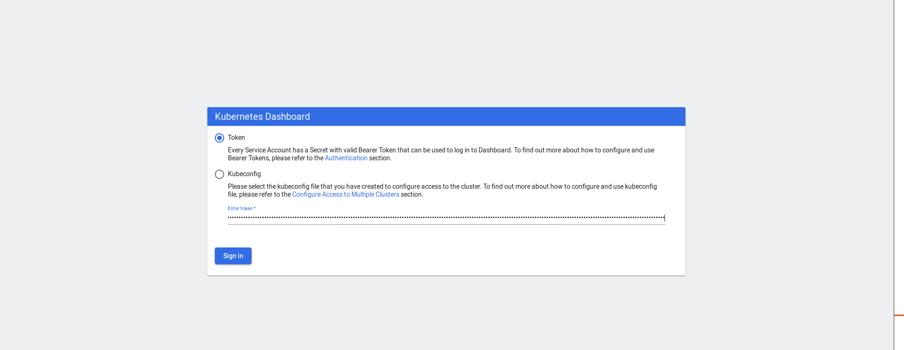
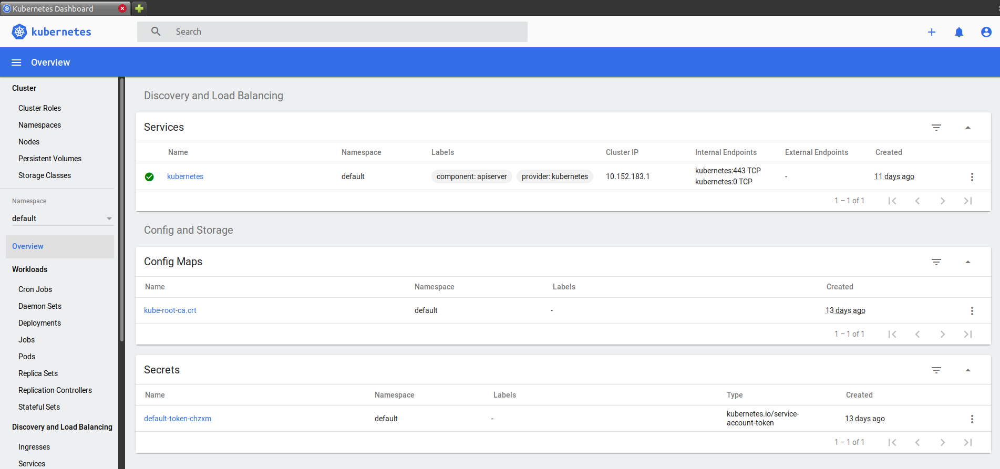

## Pré requisitos
* Docker
* Linux (de preferencia ubuntu, ja que o microk8s é desenvolvido pela canonical e otimizado para o mesmo)

## Instalação do Tilt
```
curl -fsSL https://raw.githubusercontent.com/tilt-dev/tilt/master/scripts/install.sh | bash
```
para mais informaçõs sobre o tilt : https://docs.tilt.dev/install.html

## Instalação microk8s

```
sudo snap install microk8s --classic && \
sudo microk8s.enable dns && \
sudo microk8s.enable dashboard && \
sudo microk8s.enable registry
```
```
sudo snap install kubectl --classic
```
```
cd $HOME
```
```
mkdir .kube
```
```
sudo usermod -a -G microk8s $USER && \
sudo chown -f -R $USER ~/.kube
```
```
newgrp microk8s
```

```
sudo microk8s.kubectl config view --flatten > ~/.kube/microk8s-config && \
KUBECONFIG=~/.kube/microk8s-config:~/.kube/config kubectl config view --flatten > ~/.kube/temp-config && \
mv ~/.kube/temp-config ~/.kube/config && \
kubectl config use-context microk8s
```
para mais informações sobre o microk8s: https://microk8s.io/tutorials

Após a instalação verifique se tudo está correto com o commando:
```
microk8s kubectl get all --all-namespaces
```

Algo parecido com a saida abaixo dever ser exibida no terminal

```
NAMESPACE            NAME                                             READY   STATUS    RESTARTS   AGE
kube-system          pod/metrics-server-8bbfb4bdb-rf4xh               1/1     Running   13         13d
container-registry   pod/registry-9b57d9df8-z8wtv                     1/1     Running   12         13d
kube-system          pod/coredns-7f9c69c78c-nqd6j                     1/1     Running   12         13d
kube-system          pod/calico-kube-controllers-f7868dd95-l8rjh      1/1     Running   12         13d
kube-system          pod/dashboard-metrics-scraper-78d7698477-t6xts   1/1     Running   12         13d
kube-system          pod/calico-node-gm24m                            1/1     Running   12         13d
kube-system          pod/kubernetes-dashboard-85fd7f45cb-jnzvj        1/1     Running   13         13d
ingress              pod/nginx-ingress-microk8s-controller-m7qlw      1/1     Running   11         13d
kube-system          pod/hostpath-provisioner-5c65fbdb4f-gx4fv        1/1     Running   12         13d

NAMESPACE            NAME                                TYPE        CLUSTER-IP       EXTERNAL-IP   PORT(S)                  AGE
kube-system          service/kube-dns                    ClusterIP   10.152.183.10    <none>        53/UDP,53/TCP,9153/TCP   13d
container-registry   service/registry                    NodePort    10.152.183.11    <none>        5000:32000/TCP           13d
kube-system          service/metrics-server              ClusterIP   10.152.183.109   <none>        443/TCP                  13d
kube-system          service/kubernetes-dashboard        ClusterIP   10.152.183.239   <none>        443/TCP                  13d
kube-system          service/dashboard-metrics-scraper   ClusterIP   10.152.183.129   <none>        8000/TCP                 13d
default              service/kubernetes                  ClusterIP   10.152.183.1     <none>        443/TCP                  11d

NAMESPACE     NAME                                               DESIRED   CURRENT   READY   UP-TO-DATE   AVAILABLE   NODE SELECTOR            AGE
ingress       daemonset.apps/nginx-ingress-microk8s-controller   1         1         1       1            1           <none>                   13d
kube-system   daemonset.apps/calico-node                         1         1         1       1            1           kubernetes.io/os=linux   13d

NAMESPACE            NAME                                        READY   UP-TO-DATE   AVAILABLE   AGE
kube-system          deployment.apps/hostpath-provisioner        1/1     1            1           13d
container-registry   deployment.apps/registry                    1/1     1            1           13d
kube-system          deployment.apps/metrics-server              1/1     1            1           13d
kube-system          deployment.apps/dashboard-metrics-scraper   1/1     1            1           13d
kube-system          deployment.apps/coredns                     1/1     1            1           13d
kube-system          deployment.apps/kubernetes-dashboard        1/1     1            1           13d
kube-system          deployment.apps/calico-kube-controllers     1/1     1            1           13d

NAMESPACE            NAME                                                   DESIRED   CURRENT   READY   AGE
kube-system          replicaset.apps/hostpath-provisioner-5c65fbdb4f        1         1         1       13d
container-registry   replicaset.apps/registry-9b57d9df8                     1         1         1       13d
kube-system          replicaset.apps/metrics-server-8bbfb4bdb               1         1         1       13d
kube-system          replicaset.apps/dashboard-metrics-scraper-78d7698477   1         1         1       13d
kube-system          replicaset.apps/coredns-7f9c69c78c                     1         1         1       13d
kube-system          replicaset.apps/kubernetes-dashboard-85fd7f45cb        1         1         1       13d
kube-system          replicaset.apps/calico-kube-controllers-f7868dd95      1         1         1       13d
```
## Executando um projeto com Tilt
Para executar um projeto com o Tilt o diretorio do mesmo deve conter um arquvio **Tiltfile**
executar o seguinte comando no diretório do projeto:
```
tilt up 
```
Caso queira parar e execução basta usar um CTRL+C no terminal que esta executando o Tilt
e em seguida executar o comando:
```
tilt down
```
que é responsável com apagar os pods criados no cluster MicroK8s

É possivel acessar o dashboard do cluster acessando o endereço de do service **kubernetes-dashboard**
que no exemplo acimar esta com IP: 10.152.183.239 na porta 443, não é possivel acessar a partir do chrome 
pois este não aceita o certificado autoassinado do cluster, então de preferencia para o firefox

ao acessa o dashboar sera exigido um token para acessar o painel, que pode ser obtido com o seguinte comando:
```
token=$(microk8s kubectl -n kube-system get secret | grep default-token | cut -d " " -f1)
microk8s kubectl -n kube-system describe secret $token
```
#### Imagem da tela de login no dashboard



#### Imagem do dashboard



